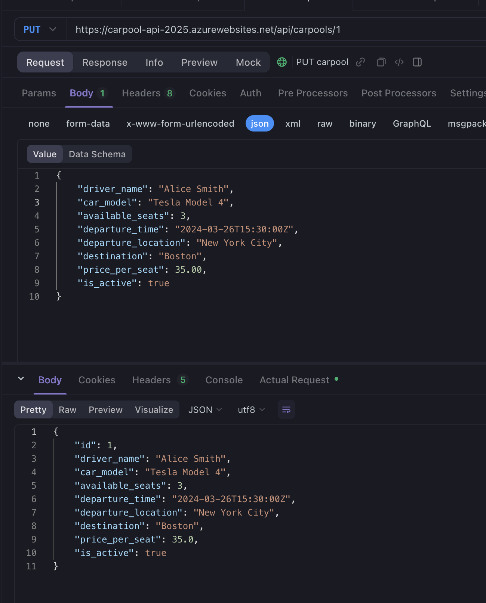

# CarPool API - Azure Function

This is a FastAPI-based CarPool API implemented as an Azure Function.

## Project Structure

```
carpool-api-azure/
├── main.py              # Main application code
├── host.json            # Host configuration
├── local.settings.json  # Local settings
└── requirements.txt     # Python dependencies
```

## Local Development

1. Create and activate a virtual environment:
```bash
python -m venv venv
source venv/bin/activate  # On Windows: venv\Scripts\activate
```

2. Install dependencies:
```bash
pip install -r requirements.txt
```

3. Install Azure Functions Core Tools:
```bash
brew install azure-functions-core-tools@4  # For macOS
# For Windows: npm install -g azure-functions-core-tools@4 --unsafe-perm true
```

4. Run locally:
```bash
func start
```

## API Endpoints

Base URL: `https://carpool-api-2025.azurewebsites.net/api`

- GET `/` - Welcome message
- GET `/carpools` - List all carpools
- GET `/carpools/{id}` - Get specific carpool
- POST `/carpools` - Create new carpool
- PUT `/carpools/{id}` - Update carpool
- DELETE `/carpools/{id}` - Delete carpool

### Example Requests

1. Create a carpool:
```bash
curl -X POST https://carpool-api-2025.azurewebsites.net/api/carpools \
  -H "Content-Type: application/json" \
  -d '{
    "driver_name": "John Doe",
    "car_model": "Toyota Camry",
    "available_seats": 3,
    "departure_time": "2024-04-28T10:00:00",
    "departure_location": "New York",
    "destination": "Boston",
    "price_per_seat": 25.00
  }'
```

2. Get all carpools:
```bash
curl https://carpool-api-2025.azurewebsites.net/api/carpools
```

## Deployment Information

The API is currently deployed to Azure with the following details:

- Function App Name: `carpool-api-2025`
- Resource Group: `carpool-rg`
- Region: `eastus`
- Runtime: Python 3.10
- Storage Account: `carpoolstorage2024`

### Deployment Steps

1. Create Resource Group:
```bash
az group create --name carpool-rg --location eastus
```

2. Create Storage Account:
```bash
az storage account create --name carpoolstorage2024 --resource-group carpool-rg --location eastus --sku Standard_LRS
```

3. Create Function App:
```bash
az functionapp create --resource-group carpool-rg --consumption-plan-location eastus --runtime python --runtime-version 3.10 --functions-version 4 --name carpool-api-2025 --storage-account carpoolstorage2024 --os-type linux
```

4. Deploy the Function:
```bash
func azure functionapp publish carpool-api-2025
```
Endpoints:





## Notes

- The API currently uses in-memory storage. For production, implement proper database storage.
- Add authentication and authorization as needed.
- Configure CORS settings in Azure Portal if required.
- Monitor the function app using Application Insights.
- Consider implementing rate limiting for production use.

## Monitoring and Logging

The function app is integrated with Application Insights. You can monitor:
- Function execution times
- Success/failure rates
- Resource utilization
- Custom telemetry

Access the monitoring dashboard at:
`https://portal.azure.com/#resource/subscriptions/{subscription-id}/resourceGroups/carpool-rg/providers/microsoft.insights/components/carpool-api-2025/overview`
